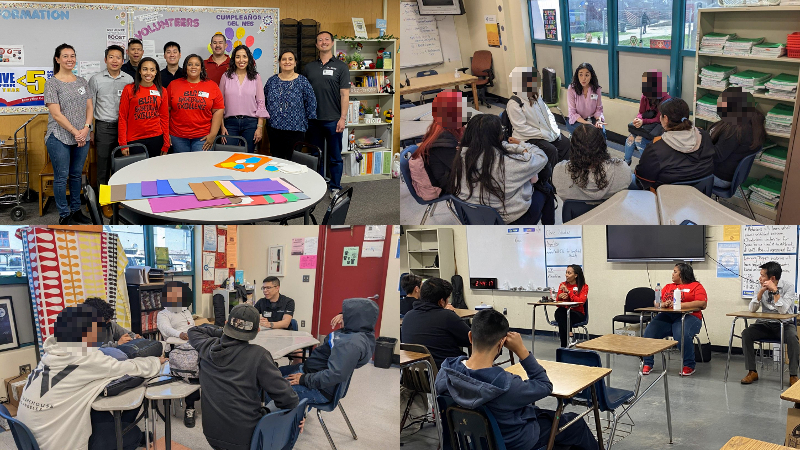

# [atet](https://github.com/atet) / [**_profile_naf_2023_**](https://github.com/atet/profile_naf_2023/blob/main/README.md#atet--profile_naf_2023)

# [Athit Kao, PhD](https://www.athitkao.com)

Panelist questions for the National Academy Foundation (NAF) STEM panel at Compton High School in April 2023.

The purpose of this event was to provide students with meaningful career awareness of engineering paths and to cultivate continued support from Raytheon Intelligence & Space, a Raytheon Technologies business.

--------------------------------------------------------------------------------------------------

> 
>
> Local employees from Raytheon Technologies' Los Angeles and San Diego offices speaking to Compton High School's NAF students.

--------------------------------------------------------------------------------------------------

***Getting to Know the Panelists***

1. _Share basic facts about yourself: Where are you from, what do you do in your company, how long have you been in your role?_

    **I am the Innovation and Outreach Lead for [Raytheon Blackbird Technologies](https://www.rtx.com/raytheon/what-we-do/cyber/who-we-are/raytheon-blackbird-technologies), a special operations-focused subsidiary of [Raytheon Technologies, the world's largest aerospace and defense company.](https://www.prnewswire.com/news-releases/most-advanced-amraam-variant-aim-120d-3-completes-critical-milestone-for-operational-use-301800951.html#:~:text=Raytheon%20Technologies%20is%20the%20world's,take%20us%20deeper%20into%20space.) I have been in this role for the past year and have been at Raytheon for about three years.**

2. _Where are you from?_

    **I moved from the DC metropolitan area over a decade ago, which is coincidentally where my physical office is now. Though, I currently work remotely from California.**

3. _Where did you go to school (high school and college) and what did you want to do when you first started college?_

    **I went to high school and college in Virginia, worked for a year, then moved to California for graduate school and have been here since. I knew in elementary school that I was interested in the sciences and pursued degrees in the life sciences.**

4. _What are your favorite types of projects associated with your role?_

    **My background is working at fast-paced startups, so anything leveraging cutting-edge technologies like artificial intelligence and machine learning. Also, I enjoy working in multidisciplinary teams because that's the only way high impact projects get done.**

5. _Describe your typical workday._

    **_A lot of meetings across a lot of projects._ As a mid-career engineer, I am typically leading technical and business development efforts. As much as I miss individual contributorship work like software programming, the wisdom that I have gained during that time of my career is better served at a leadership level.**

—

***College and Career Journey***

6. _Discuss your educational background and the role your education played in preparing you to work in your current field._

    **I learned to be [proactive](https://en.wikipedia.org/wiki/The_7_Habits_of_Highly_Effective_People#Habit_1:_%22Be_proactive%22) about where I could go in my career so I wouldn't get stuck somewhere I didn't want to be. My undergraduate degree is in biology with a focus on bioinformatics. That led to using my bioinformatics skills to get into computer science in graduate school. Working in the biotech industry solidified all my various skills into becoming a full-stack data scientist. After deciding to leave the life sciences sector, many doors seemed to open up, from the video gaming industry to aerospace and defense.**

7. _Talk about your career trajectory and where you are today._

    **I followed the traditional route of becoming a scientist after undergrad. After a year of working in biotech, I realized that for my field, I could not get as far as I wanted with just a bachelor's degree. Planning with the [end in mind](https://en.wikipedia.org/wiki/The_7_Habits_of_Highly_Effective_People#Habit_2:_%22Begin_with_the_end_in_mind%22), I went back to school to pursue my PhD in a state-of-the-art field. After grad school and working for many years back in biotech, I decided to make a career pivot out of the life sciences and have found that my technical and leadership skills were transferable elsewhere.**

8. _Share how you made your postsecondary/college decision._

    **I was well into high school before I got serious about going to college. After visiting my older brother at his university and seeing how an undergraduate experience could positively change my life, I reprioritized EVERYTHING. I got involved in extracurriculars, enrolled in AP courses, sacrificed my social life, and got my first job; all that to ensure I [put first things first](https://en.wikipedia.org/wiki/The_7_Habits_of_Highly_Effective_People#Habit_3:_%22Put_first_things_first%22).**

9. _Are you currently doing what you envisioned in high school? Share what you planned on doing and how your educational and career journey shaped that vision._

    **Not at all. I was in JROTC in high school and thought that the military would've been the option for me afterwards. After taking AP classes in biology and computer science, I realized that there was much more value I could offer; not just to myself, but to the world as well. I didn't completely see it then, but in retrospect, I discovered a [win-win](https://en.wikipedia.org/wiki/The_7_Habits_of_Highly_Effective_People#Habit_4:_%22Think_win%E2%80%93win%22) scenario where I'd enjoy the challenges of a STEM career while advancing scientific progress.**

—

***Networking and Making Professional Connections***

10. _Describe your definition of networking._

    **Finding others that you genuinely resonate with by listening to their stories and journeys so that you can truly relate. [Seeking to fully understand others](https://en.wikipedia.org/wiki/The_7_Habits_of_Highly_Effective_People#Habit_5:_%22Seek_first_to_understand,_then_to_be_understood%22) is the key to meaningful relationships that will propel your personal, professional, and career development.**

11. _Discuss how your professional network has impacted your postsecondary and career journey._

    **I have too many examples to list, but I will summarize with two big themes over my education and career: My professional network has challenged me to strive for more than I thought I could achieve and that they provided the mentorship to support me along my career journey.**

12. _Share tips for building a professional network. Who should students connect with?_

    **Find the people doing exactly what you want to do and learn directly from them. Start with the people you know and be explicit about your intentions for professional development. [Synergize](https://en.wikipedia.org/wiki/The_7_Habits_of_Highly_Effective_People#Habit_6:_%22Synergize%22) your efforts with your friends and share your resources; doing so selflessly will really result in 1 + 1 = >2.**

13. _How do you maintain professional relationships throughout college and career?_

    **This is one of the hardest things adults face; making time to keep up with their network. It doesn't get easier as your network expands, so you must make a deliberate effort to carve out time and have the discipline to maintain it.**

14. _How has your professional network helped you learn and grow during your career?_

    **I enjoy working with my various colleagues across our 180,000-person company, my federal customer, and other external collaborators. I am glad I can bring value to my network through collaboration and volunteering as I find their mentorship and coaching have brought immense value to me.**

—

***Professional Learning and Growth***

15. _How do you make continuous learning a part of your career?_

    **When you find that one thing you're good at, that you are truly passionate about, that you can make a living from, and brings value to your community, you will have no problem integrating it with your everyday life. Doing so will ensure you continually progress.**

16. _What resources do you use to grow professionally?_

    **It's now easier than ever to ["sharpen the saw"](https://en.wikipedia.org/wiki/The_7_Habits_of_Highly_Effective_People#Habit_7:_%22Sharpen_the_saw%22). Whether it's the wealth of free education or ability to network with literally anyone around the world, a person starting their career now has orders of magnitude more resources than just a couple decades ago.**

17. _Why is continuous learning important throughout your career?_

    **Without being willing to learn new things, I would not be where I am today. I would not have gone to college, gone back to school, changed my focus to computer science, pivoted to the video gaming industry, and then again into being an engineer in the aerospace and defense sector. In retrospect, it's not just about getting to where I am now, but also about enjoying the variety along the way.**

18. _Share the best advice you have received during your career._

    **The world is moving faster than any of us could truly "catch up" to. Wise words from a former, seasoned colleague at Raytheon, Steven M. Sweeny, "you'll be frustrated, but that's normal," More recently speaking to Mr. Sweeny, "the pace of change is faster than humans can fathom. So much so that senior tech leaders are saying it should slow down," (in reference to [Pause Giant AI Experiments: An Open Letter](https://futureoflife.org/open-letter/pause-giant-ai-experiments/)). I take this as, prioritize what will bring me the best bang for my buck and don't be sad about neglecting others.**

[Back to Top](#table-of-contents)

--------------------------------------------------------------------------------------------------

Copyright © 2023-∞ Athit Kao, <a href="http://www.athitkao.com/tos.html" target="_blank">Terms and Conditions</a>

